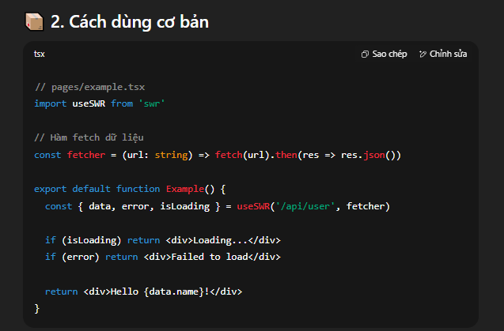
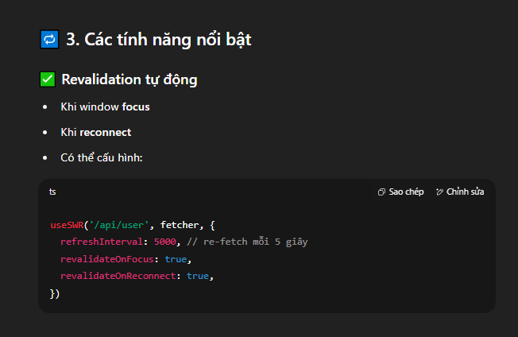
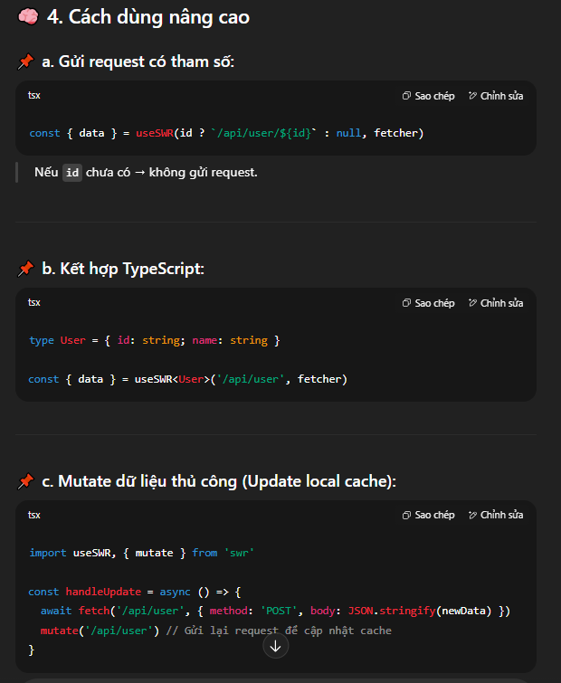
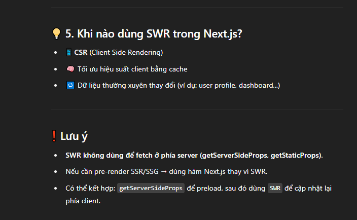
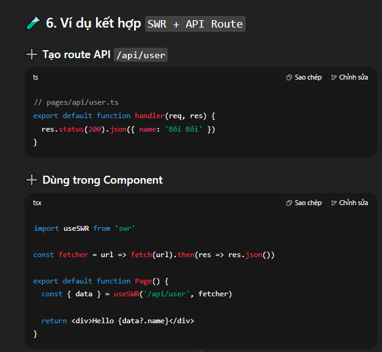

# 🧠 SWR là gì?
SWR viết tắt của: Stale-While-Revalidate: Dữ liệu cũ vẫn được dùng trước, đồng thời gửi request mới để cập nhật.
- ✅ Tự động cache và revalidate dữ liệu
- ✅ Tự động re-fetch khi chuyển tab quay lại
- ✅ Dễ dùng, kết hợp tốt với Next.js CSR
- 
- 
- 
- 
- 